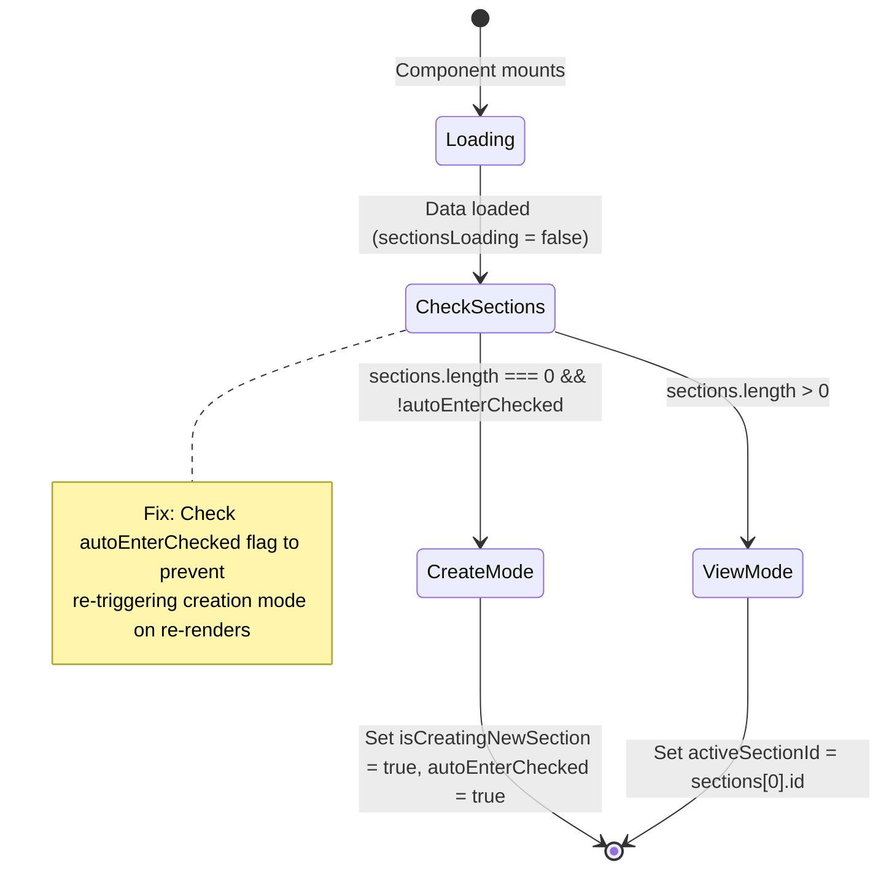
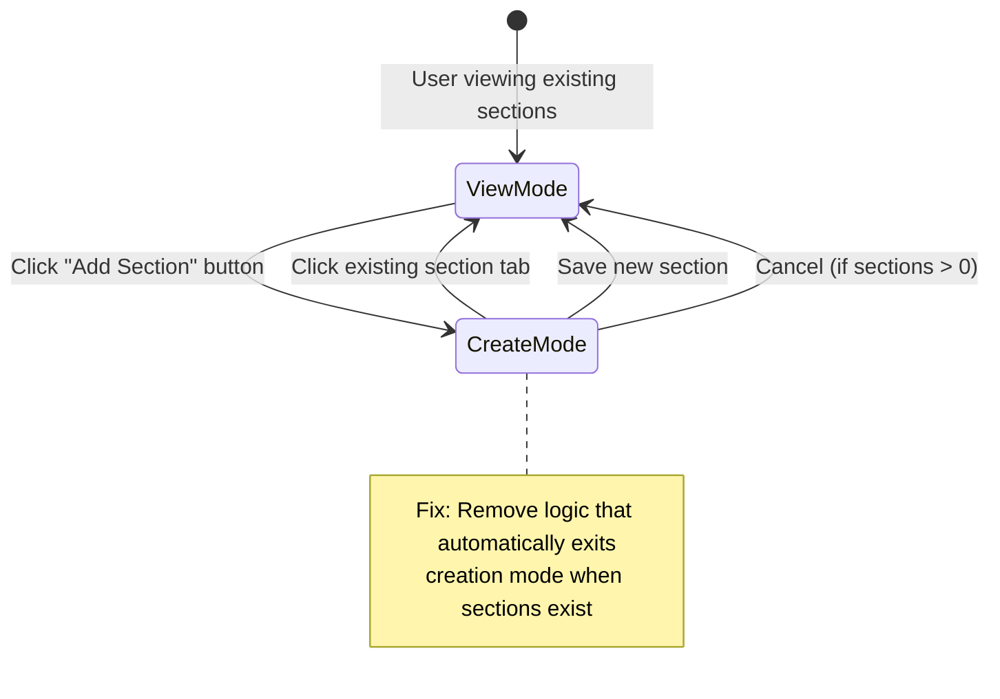
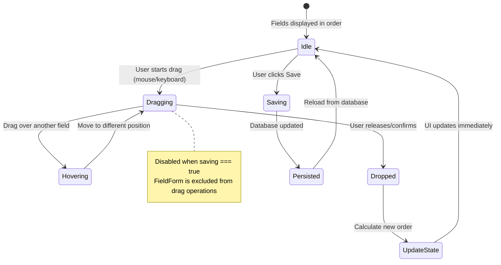

# Data Model: Fix Predefine Page Bugs and Add Field Drag-and-Drop

**Phase**: 1 (Design & Contracts)  
**Date**: December 23, 2025  
**Status**: Complete

## Overview

This document defines the data structures and state management patterns for the predefine page bug fixes and drag-and-drop feature. No database schema changes are required.

## Frontend State Model

### Component State (PredefinePage)

```typescript
// Existing state - No changes to structure
interface PredefinePageState {
  sections: SectionConfig[];              // Array of sections from database
  activeSectionId: string | null;         // Currently selected section
  isCreatingNewSection: boolean;          // Creation mode toggle
  saving: boolean;                        // Save operation in progress
  errors: string[];                       // Validation/save errors
  loadingAfterSave: boolean;             // Loading state after save
  pendingFields: Map<string, Omit<FieldConfig, 'id'> | null>;  // Unsaved fields
  tempSectionNames: Map<string, string>;  // Temporary section name edits
  autoEnterChecked: React.MutableRefObject<boolean>;  // NEW: Initialization flag
}

// Key Types (from existing types.ts)
interface SectionConfig {
  id: string;                             // Client-side generated UID
  name: string;                           // Section name (e.g., "General", "Stats")
  fields: FieldConfig[];                  // Ordered array of fields
}

interface FieldConfig {
  id: string;                             // Database ID or client UID for new fields
  label: string;                          // Field label (e.g., "name", "description")
  dataType: FieldType;                    // 'string' | 'number' | 'boolean' | 'date' | 'enum' | 'reference' | 'image' | 'file' | 'richtext'
  required: boolean;                      // Whether field is mandatory
  enumOptions?: string[];                 // Options for enum type
  referenceLibraries?: string[];         // Library IDs for reference type
}

type FieldType = 
  | 'string' 
  | 'number' 
  | 'boolean' 
  | 'date' 
  | 'enum' 
  | 'reference' 
  | 'image' 
  | 'file' 
  | 'richtext';
```

### Drag-and-Drop State

```typescript
// New state for drag-and-drop (internal to FieldsList component)
interface DragState {
  activeId: string | null;                // ID of field being dragged
  overId: string | null;                  // ID of field being hovered over
}

// Drag event payload
interface DragEndEvent {
  active: { id: string };                 // Dragged item
  over: { id: string } | null;           // Drop target
}
```

## Database Model

### Existing Schema (No Changes)

```sql
-- Table: library_field_definitions
-- Purpose: Stores field definitions for library predefine templates
-- No modifications required - order_index column already exists

CREATE TABLE library_field_definitions (
  id UUID PRIMARY KEY DEFAULT uuid_generate_v4(),
  library_id UUID NOT NULL REFERENCES libraries(id) ON DELETE CASCADE,
  section TEXT NOT NULL,                  -- Section name
  label TEXT NOT NULL,                    -- Field label
  data_type TEXT NOT NULL,               -- Field type (string, number, etc.)
  required BOOLEAN DEFAULT false,
  enum_options TEXT[],                   -- For enum type
  reference_libraries UUID[],            -- For reference type
  order_index INTEGER NOT NULL,          -- ⭐ Used for field ordering
  created_at TIMESTAMPTZ DEFAULT NOW(),
  updated_at TIMESTAMPTZ DEFAULT NOW()
);

-- Indexes (existing)
CREATE INDEX idx_library_field_definitions_library_id 
  ON library_field_definitions(library_id);
CREATE INDEX idx_library_field_definitions_section_order 
  ON library_field_definitions(library_id, section, order_index);

-- RLS Policies (existing - no changes)
-- Users can only access field definitions for libraries they own
```

## State Transitions

### 1. Page Load Flow (Bug Fix Applied)



### 2. Add Section Button Flow (Bug Fix Applied)



### 3. Drag-and-Drop Flow (New Feature)



## Validation Rules

### Field Order Validation

```typescript
// When persisting field order:
// 1. All fields must have unique order_index values
// 2. order_index should be sequential starting from 0
// 3. Gaps in order_index are acceptable but normalized on save

function normalizeFieldOrder(fields: FieldConfig[]): FieldConfig[] {
  return fields.map((field, index) => ({
    ...field,
    order_index: index, // Assign sequential index based on array position
  }));
}
```

### State Consistency Rules

```typescript
// Rules enforced in state management:
// 1. isCreatingNewSection can only be true if user explicitly clicked "Add Section"
//    OR if sections.length === 0 on initial load
// 2. activeSectionId must always reference a valid section ID when sections exist
// 3. autoEnterChecked flag prevents multiple creation mode triggers
// 4. Drag operations disabled when saving === true

// Example validation:
function validateState(state: PredefinePageState): boolean {
  // If not in creation mode and sections exist, activeSectionId must be valid
  if (!state.isCreatingNewSection && state.sections.length > 0) {
    return state.sections.some(s => s.id === state.activeSectionId);
  }
  
  // If in creation mode with existing sections, must be user-initiated
  if (state.isCreatingNewSection && state.sections.length > 0) {
    return true; // Assume user clicked "Add Section"
  }
  
  return true;
}
```

## Data Flow Diagrams

### Save Operation with Field Reordering

```
User drags field
      ↓
Local state updates (fields array reordered)
      ↓
User clicks "Save"
      ↓
normalizeFieldOrder(fields) → assign sequential order_index
      ↓
saveSchemaIncremental(supabase, libraryId, sections)
      ↓
Database UPDATE library_field_definitions SET order_index = ?
      ↓
reloadSections() → fetch from database
      ↓
UI updates with persisted order
```

### Load Operation

```
Component mounts
      ↓
useSchemaData hook activates
      ↓
Fetch: SELECT * FROM library_field_definitions 
       WHERE library_id = ? 
       ORDER BY section, order_index
      ↓
Group fields by section
      ↓
setSections(loadedSections)
      ↓
useEffect: Check sections.length
      ↓
If empty → setIsCreatingNewSection(true)
If exists → setActiveSectionId(sections[0].id)
```

## Entity Relationships

```
Library (1) ──── (N) FieldDefinitions
                       │
                       ├─ Grouped by: section (string)
                       ├─ Ordered by: order_index (integer)
                       └─ Rendered as: SectionConfig → FieldConfig[]
                       
Component Hierarchy:
PredefinePage
  ├─ Tabs (Ant Design)
  │   ├─ Tab: Section 1
  │   │   └─ FieldsList (DndContext)
  │   │       ├─ SortableContext
  │   │       │   ├─ FieldItem 1 (useSortable)
  │   │       │   ├─ FieldItem 2 (useSortable)
  │   │       │   └─ FieldItem N (useSortable)
  │   │       └─ FieldForm (non-draggable)
  │   ├─ Tab: Section 2
  │   └─ Tab: New Section (conditional)
  └─ Add Section Button
```

## Summary

**Key Data Model Decisions**:

1. ✅ No database schema changes required (order_index column exists)
2. ✅ State management simplified by consolidating useEffect hooks
3. ✅ Drag-and-drop state isolated to FieldsList component
4. ✅ Field order persisted through existing save mechanisms
5. ✅ Validation rules ensure data consistency

**Next Steps**: Create quickstart guide for implementation (Phase 1 continues)

